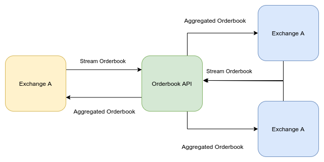
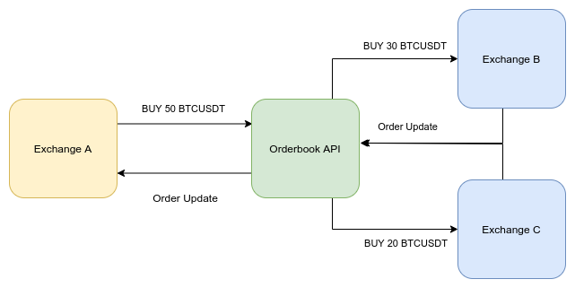

# CEA Orderbook Liquidity Aggregator

## Overview

The Orderbook liquidity aggregator is a platform that allows exchanges to aggregate their orderbook with multiple other exchanges, significantly increasing the available liquidity executing orders that would otherwise take a long time to complete.

## How it works

Using the Orderbook websocket [API](/api), exchanges can stream their orderbook getting back an aggregated orderbook. 

Then they can submit new orders to the platform which will be executed by one or many of the other exchanges participating.

## Wallets

The Orderbook Aggregator platform uses a third-party wallet service that allows us to move founds across exchanges. Once orders are reported as executed founds will be moved across the API wallets accordingly.